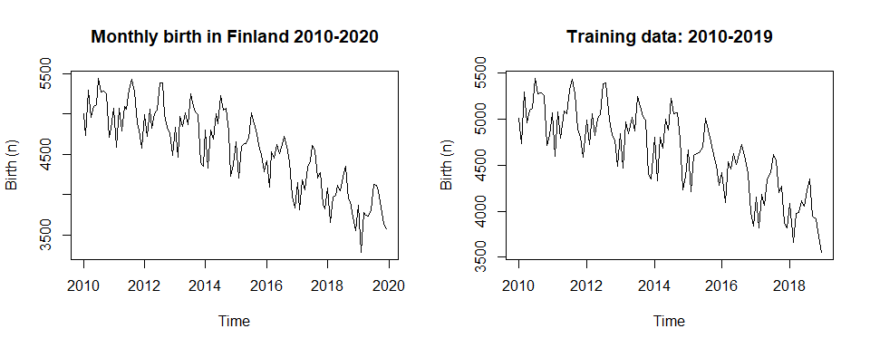
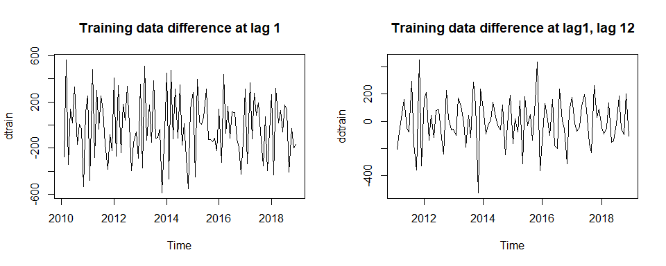
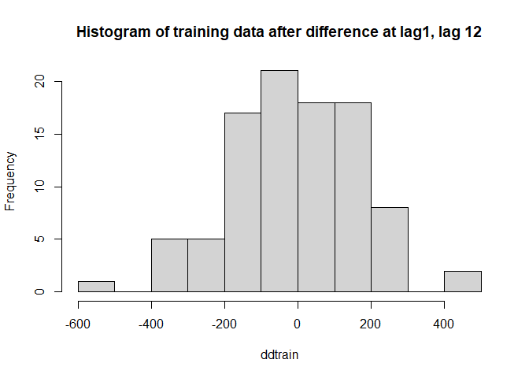
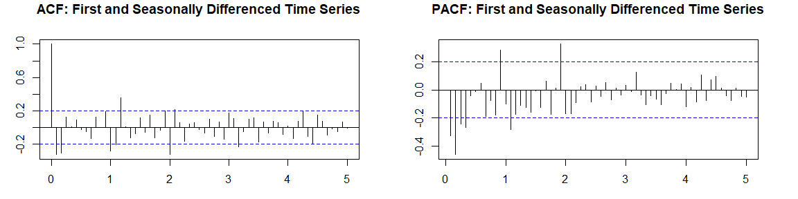
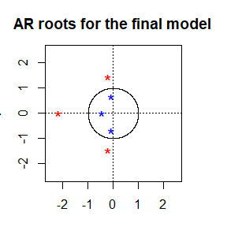
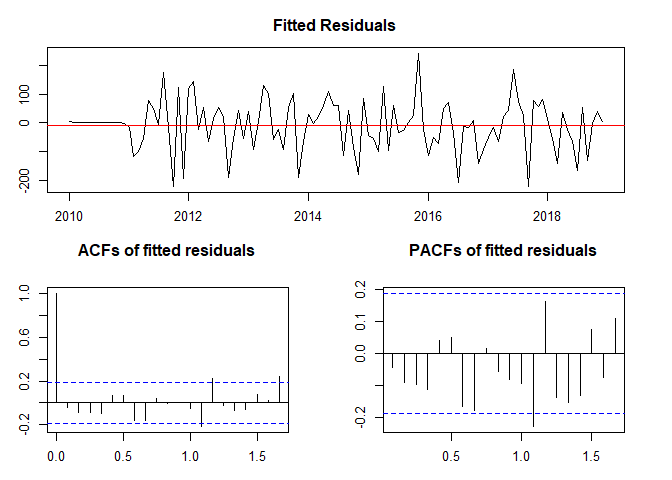
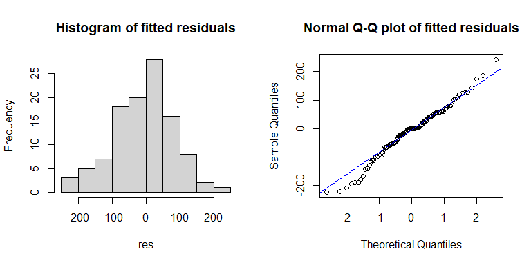
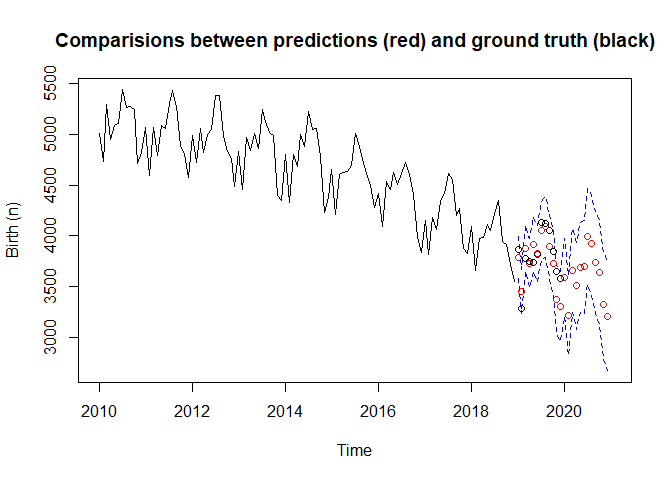

Time series analysis of Finland monthly birth during 2010-2020
================

# Data exploration

``` r
birth.csv = read.table("D:/finland_birth.csv",sep=",", header=TRUE)

par(mfrow=c(1,2))
birth = ts(birth.csv$birth[1:120], start = c(2010,1),frequency=12)
ts.plot(birth,main = "Monthly birth in Finland 2010-2020",ylab = 'Birth (n)')

train=ts(birth.csv$birth[1:108], start = c(2010,1),frequency=12)
ts.plot(train,main = "Training data: 2010-2019",ylab = 'Birth (n)')
```



``` r
test=ts(birth.csv$birth[109:120], start = c(2019,1),frequency=12)
```

``` r
par(mfrow=c(1,2))
dtrain <- diff(train,1)
plot(dtrain,main = 'Training data difference at lag 1',ylab = )

ddtrain <- diff(dtrain,12)
plot(ddtrain,main = 'Training data difference at lag1, lag 12',ylab = )
```



``` r
var(train)
```

    ## [1] 199158.3

``` r
var(dtrain)
```

    ## [1] 74861.59

``` r
var(ddtrain)
```

    ## [1] 30512.02

``` r
hist(ddtrain,main = 'Histogram of training data after difference at lag1, lag 12')
```



``` r
par(mar=c(3,3,3,3))
par(mfrow=c(1,2))

acf( ddtrain, lag.max = 60, main = "ACF: First and Seasonally Differenced Time Series")

pacf( ddtrain, lag.max = 60, main = "PACF: First and Seasonally Differenced Time Series")
```



# Model fitting

P=2, p=4, D=1, d=1, Q=2, q=2

``` r
#infinite number
#arima(train, order=c(4,1,2), seasonal = list(order = c(2,1,2), period = 12), method="ML")
```

P=2, p=2, D=1, d=1, Q=2, q=2

``` r
arima(train, order=c(2,1,2), seasonal = list(order = c(2,1,2), period = 12), method="ML")
```

    ## 
    ## Call:
    ## arima(x = train, order = c(2, 1, 2), seasonal = list(order = c(2, 1, 2), period = 12), 
    ##     method = "ML")
    ## 
    ## Coefficients:
    ##           ar1      ar2      ma1      ma2     sar1     sar2    sma1     sma2
    ##       -0.5056  -0.2457  -0.2335  -0.2568  -0.9340  -0.3501  0.3397  -0.5273
    ## s.e.   0.3602   0.1553   0.3492   0.3055   0.2291   0.2064  0.5469   0.5039
    ## 
    ## sigma^2 estimated as 9972:  log likelihood = -581.51,  aic = 1181.03

P=1, p=4, D=1, d=1, Q=2, q=2

``` r
#choose this one
arima(train, order=c(4,1,2), seasonal = list(order = c(1,1,2), period = 12), method="ML")
```

    ## 
    ## Call:
    ## arima(x = train, order = c(4, 1, 2), seasonal = list(order = c(1, 1, 2), period = 12), 
    ##     method = "ML")
    ## 
    ## Coefficients:
    ##           ar1      ar2      ar3      ar4      ma1     ma2     sar1    sma1
    ##       -0.1651  -1.0347  -0.3843  -0.4445  -0.4790  0.7625  -0.5853  0.1677
    ## s.e.   0.2306   0.1583   0.1297   0.1317   0.2453  0.1277   0.1352  0.2372
    ##          sma2
    ##       -0.8321
    ## s.e.   0.2185
    ## 
    ## sigma^2 estimated as 9471:  log likelihood = -581.87,  aic = 1183.73

P=1, p=4, D=1, d=1, Q=1, q=2

``` r
arima(train, order=c(4,1,2), seasonal = list(order = c(1,1,1), period = 12), method="ML")
```

    ## 
    ## Call:
    ## arima(x = train, order = c(4, 1, 2), seasonal = list(order = c(1, 1, 1), period = 12), 
    ##     method = "ML")
    ## 
    ## Coefficients:
    ##           ar1      ar2      ar3      ar4      ma1      ma2     sar1     sma1
    ##       -0.2811  -0.2562  -0.0224  -0.0521  -0.4787  -0.1322  -0.0022  -0.7403
    ## s.e.   0.9530   0.3401   0.2998   0.2264   0.9485   0.7930   0.1772   0.1892
    ## 
    ## sigma^2 estimated as 11784:  log likelihood = -585.37,  aic = 1188.75

``` r
arima(train, order=c(4,1,0), seasonal = list(order = c(1,1,2), period = 12),  method="ML")
```

    ## 
    ## Call:
    ## arima(x = train, order = c(4, 1, 0), seasonal = list(order = c(1, 1, 2), period = 12), 
    ##     method = "ML")
    ## 
    ## Coefficients:
    ##           ar1      ar2      ar3      ar4    sar1    sma1     sma2
    ##       -0.6864  -0.6594  -0.3306  -0.1806  -0.693  0.1660  -0.8334
    ## s.e.   0.1038   0.1207   0.1196   0.1029   0.124  0.2516   0.2294
    ## 
    ## sigma^2 estimated as 9936:  log likelihood = -583.25,  aic = 1182.49

``` r
fit.i=arima(train, order=c(3,1,0), seasonal = list(order = c(1,1,2), period = 12),  fixed = c(NA, NA, NA, NA,0, NA), method="ML")
fit.i
```

    ## 
    ## Call:
    ## arima(x = train, order = c(3, 1, 0), seasonal = list(order = c(1, 1, 2), period = 12), 
    ##     fixed = c(NA, NA, NA, NA, 0, NA), method = "ML")
    ## 
    ## Coefficients:
    ##           ar1      ar2      ar3     sar1  sma1     sma2
    ##       -0.6465  -0.5578  -0.2192  -0.6604     0  -0.9988
    ## s.e.   0.1030   0.1064   0.1020   0.1171     0   0.3444
    ## 
    ## sigma^2 estimated as 8984:  log likelihood = -584.76,  aic = 1181.51

# Diagnostic checking

``` r
par(mar=c(3,3,3,3))
source("plot.roots.R")
plot.roots(NULL,polyroot(c(1, 0.6465, 0.5578, 0.2192)), main="AR roots for the final model", size=2.5)
```



``` r
res = fit.i$residuals
mean(res)
```

    ## [1] -9.616669

``` r
par(mar=c(3,3,3,3))
layout(matrix(c(1,1,2,3),2,2,byrow=T))
ts.plot(res,main = "Fitted Residuals")
t = 1:length(res)
fit.res = lm(res~t)
abline(fit.res)
abline(h = mean(res), col = "red")
# acf
acf(res,main = "ACFs of fitted residuals")
# pacf
pacf(res,main = "PACFs of fitted residuals")
```



``` r
Box.test(res, lag = 10, type = c("Box-Pierce"), fitdf = 5)
```

    ## 
    ##  Box-Pierce test
    ## 
    ## data:  res
    ## X-squared = 9.6151, df = 5, p-value = 0.08691

``` r
Box.test(res, lag = 10, type = c("Ljung-Box"), fitdf = 5)
```

    ## 
    ##  Box-Ljung test
    ## 
    ## data:  res
    ## X-squared = 10.371, df = 5, p-value = 0.06539

``` r
Box.test(res^2, 10, type = c("Ljung-Box"), fitdf = 0)
```

    ## 
    ##  Box-Ljung test
    ## 
    ## data:  res^2
    ## X-squared = 4.1254, df = 10, p-value = 0.9415

``` r
shapiro.test(res)
```

    ## 
    ##  Shapiro-Wilk normality test
    ## 
    ## data:  res
    ## W = 0.98254, p-value = 0.169

``` r
par(mfrow=c(1,2))
# Histogram
hist(res,main = "Histogram of fitted residuals")
# q-q plot
qqnorm(res,main = "Normal Q-Q plot of fitted residuals")
qqline(res,col ="blue")
```



# Model prediction

``` r
pred.tr=predict(fit.i, n.ahead = 24)

U.tr= pred.tr$pred + 2*pred.tr$se # upper bound for the prediction interval for transformed data
L.tr= pred.tr$pred - 2*pred.tr$se # lower bound
ts.plot(train, xlim=c(2010,2021), ylim = c(min(L.tr),max(train)),ylab = 'Birth (n)',main='Comparisions between predictions (red) and ground truth (black)') #plot y.tr and forecast
lines(U.tr, col="blue", lty="dashed")
lines(L.tr, col="blue", lty="dashed")
points(pred.tr$pred, col="red")
points(test, col="black")
```


